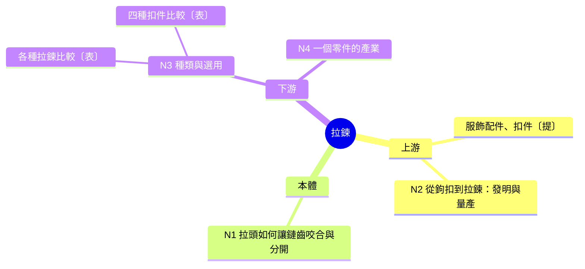

# 脈絡地圖：拆節點的方法

SKILL.md 階段 2 讀取。經典文本單元改用 `classical-text.md` 的文本地圖。

一個陌生名詞要真的懂，需要兩個方向：**往內**看它怎麼運作 (本體)，**往外**看它從哪來、往哪去、跟誰同類 (脈絡)。只往內挖會鑽進更底層的學科知識，只往外擴會變成一串故事。脈絡地圖把兩邊放在同一張圖上，再用權重決定哪些值得完整講。

全檔以「拉鍊」當示範，只用來說明格式，不要套用它的節點結構。

## 步驟 0：判斷類型與位置

**類型**，依序判斷，符合就停：

1. 自然科學中描述作用或過程的詞 → 機制型科學術語
2. 有起訖時間，重點在發生了什麼 → 歷史事件
3. 佔有空間、看得到摸得到 → 實體物件
4. 以上皆非 → 抽象概念

**位置**，所有類型共用一個判斷：這段內容講的是它自己內部，還是它和外界 (人、社會、環境) 的關係？

| 位置 | 判斷標準 | 拉鍊的例子 |
|---|---|---|
| 本體 | 它自己內部：怎麼運作、為什麼是這樣，不論哪個時間點都成立 | 拉頭如何讓鏈齒咬合 |
| 上游 | 它出現之前，或它之所以出現的原因 | 發明與量產的經過 |
| 下游 | 它出現之後，和外界發生的事 | 用途、產業、廢棄 |

同一件事只放一個位置。歷史事件的本體是反覆推動事件的因果「引擎」，哪一年發生什麼屬於下游，依時間排列。

各子類的重點 (沒有完全符合的子類時，挑最接近的一列類推)：

| 類型 | 子類 | 本體 | 上游 | 下游 |
|---|---|---|---|---|
| 實體物件 | 人造物與技術 | 怎麼運作、為什麼有這些性質；本質就是做法的東西 (髮型、陶瓷)，做法屬本體 | 發明、原料 | 種類與用途、產業、廢棄與管制 |
| | 生物 | 形態構造、取食、適應、繁殖策略與一生的階段 | 演化來源、分類地位 | 與人的關係、分布與數量變化 |
| | 地點與地形 | 怎麼形成、自然特徵、地理位置的意義 | 名稱由來、早期人類活動 | 資源與經濟、衝突與政治、環境現況 |
| 抽象概念 | 理論、原理與方法 | 定義、形式表達、核心推論 | 誰提出、為了解決什麼問題 | 應用、延伸理論、其他領域的對應 |
| | 文化形式 | 構成規則 (結構、格律、節奏、步法) | 起源與命名 | 演變與變體、代表作品、現況 |
| | 組織與制度 | 運作方式 (權力結構、決策規則、資金來源) | 創立背景 | 重大事件與爭議、影響、現況 |
| 歷史事件 | 單一事件 | 推動事件的因果引擎 | 前因與背景 | 經過 (依時間)、應對、後果 |
| | 時期與政體 | 擴張、維持與衰落的機制 | 興起前的背景 | 各階段經過、遺緒 |
| | 族群與社會運動 | 群體怎麼形成、為什麼同化或保留特色 | 原居地背景與遷移動因 | 各階段經過、文化影響、現況 |
| 機制型科學術語 | (不分子類) | 作用機制 | 發現經過 | 實際應用、相關爭議 |

教材 frontmatter 的類型標籤寫成 `類型/大類/子類`，例如 `類型/實體物件/生物`。

**範圍過大時** (跨越數百年、多個國家或大量子主題，例如一整個帝國或學科)：第一則回覆先畫全景地圖 (只列項目、不編號)，用選擇題框請使用者選切入面，選項為 3 到 4 個主軸加上「綜覽全貌，每段只講重點」。學前診斷延到選定後再出，並依選定的主軸重新做步驟 1 到 4。

## 步驟 1：判定深淺

深淺由「本體有幾段機制」決定。段數容易被數多，所以用寫考題來數：

1. 先假設是淺題 (1 段)。
2. 每多算一段，就替它寫一題驗收題，這題要同時做到：只學會其他段的人答不出來 (獨立)；答案需要說明原因或機制，查得到的外觀、數據、清單不算 (要解釋為什麼)。
3. 寫得出來才算一段，寫不出來就併進既有的段或降為脈絡項目。考題存進隱藏評分草稿，之後出驗收題時沿用。

| 判定 | 本體段數 | 主節點總數 | 本體主節點 | 脈絡主節點 |
|---|---|---|---|---|
| 淺題 | 1 | 4 到 5 | 1 到 2 | 3 到 4 |
| 中等 | 2 到 3 | 6 到 7 | 2 到 3 | 3 到 5 |
| 深題 | 4 以上 | 8 到 10 | 4 到 7 | 2 到 3，至少 1 個講下游的現實應用或社會影響 |

判定寫成一行放在地圖最上方，例如「判定：淺題，本體只有『拉頭推動鏈齒咬合』一段」。學前診斷會附一題深度選擇，使用者選的深度與判定不同時，以使用者為準重新分配權重。

## 步驟 2：填欄位

把相關項目分進下列欄位，可以列 15 到 25 個，不必每欄都有。一個項目只放一欄，歸到它在本單元扮演的角色。

| 欄位 | 位置 | 放什麼 | 預設權重 |
|---|---|---|---|
| 上位概念、常一起出現的詞 | 上游 | 所屬大類、讀資料時會並列出現的詞與相鄰構件 | 一句帶過 |
| 起源與時點背景 | 上游 | 原料、發明者、思想來源、年代、促成條件、詞源 | 視主題而定 |
| 本體機制 | 本體 | 依步驟 0 的本體欄 | 主節點 |
| 邊界與常見誤解 | 本體 | 它不是什麼、最容易和什麼混淆 | 寫進所屬主節點 |
| 分類 | 下游 | 它自己的子類 (金屬拉鍊、尼龍拉鍊) | 表格列或主節點 |
| 發展與應用 | 下游 | 依步驟 0 的下游欄 | 主節點 |
| 現況與遺緒 | 下游 | 現在還在嗎、留下了什麼 | 視主題而定 |
| 橫向對比 | 橫向 | 同層級的其他東西 (拉鍊、鈕扣、魔鬼氈) | 表格 |

起源、時點背景、現況裡的年代、數據、人物與因果，寫之前依 SKILL.md「查證與引用」先查證。脈絡內容最容易被說成只對一半的版本，例如把「輿論不再討論」說成「政策停止執行」。

## 步驟 3：分權重

| 權重 | 意思 | 計入進度 | 地圖標記 |
|---|---|---|---|
| 主節點 | 完整講一則，有自己的考點 | 是 | 編號 N1、N2…… |
| 表格列 | 收進某個主節點內的比較表 | 否 | 縮排在所屬主節點下，標〔表〕 |
| 一句帶過 | 在相關節點裡提一句 | 否 | 標〔提〕 |

- 一個主節點 = 一個獨立考點 + 一則回覆講得完。考同一件事的項目合成一個。
- 三個以上同類概念收成一張比較表，掛在最相關的主節點下。只有「比較」本身是重要考點時，才讓它成為主節點 (地圖上放在「橫向」組)；否則地圖不另列橫向組。
- 常見誤解寫進所屬主節點；更基礎的學科知識在用到的地方當場補，不獨立成節。
- 講解順序：本體主節點在前，脈絡主節點在後。歷史事件改依時間排序，本體節點放在它在時間線上出現的位置。

## 步驟 4：自我檢查

1. 每段本體機制都有一題通過檢查的考題；節點數落在判定的範圍內。
2. 任兩個主節點不考同一件事；分類表和橫向對比表不重複。
3. 至少有一張橫向對比表；深題至少有一個主節點講下游的現實影響。
4. 沒有為了湊數或為了出診斷題而設的節點；節點名稱沒有寫出診斷題的答案。

## 呈現

聊天中用縮排文字樹，教材中用 Mermaid 心智圖，兩者結構相同。新增節點時只要在對應的組下加一行。

```
判定：淺題，本體只有「拉頭推動鏈齒咬合」一段
拉鍊 (Zipper)
├ 上游
│ ├ 服飾配件、扣件〔提〕
│ └ N2 從鉤扣到拉鍊：發明與量產
├ 本體
│ └ N1 拉頭如何讓鏈齒咬合與分開
└ 下游
  ├ N3 種類與選用
  │ ├ 各種拉鍊的材質與用途〔表〕
  │ └ 拉鍊、鈕扣、魔鬼氈、按扣比較〔表〕
  └ N4 一個零件的產業
```



心智圖的節點文字不能有半形括號 `()` `[]` `{}`，會被解析成節點形狀而吃掉文字；權重標記用全形 `〔表〕` `〔提〕`，原文名稱寫在節點表中。
