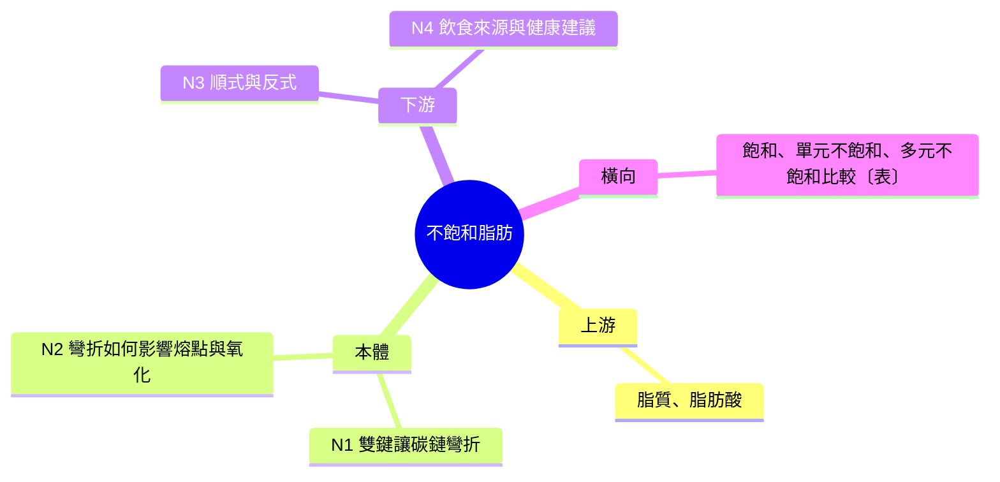

# 教材檔模板

建立教材骨架時複製以下結構。尚未有內容的章節保留標題，內容寫「(待補)」，讓使用者看得出教材會逐步長出來。「起點問題」章節只在經過觀察查核或圖片辨識的單元保留；「操作步驟」章節只在可跟做的學科保留；其他情況整節刪除。經典文本單元的章節替換見 `classical-text.md`。

## 模板

````markdown
---
tags:
  - 學科/生醫農/生命科學/營養
  - 類型/機制型科學術語
  - stolas
aliases:
  - 不飽和脂肪酸
---

| 討論主題 | 學科 | 日期 |
|---|---|---|
| 不飽和脂肪 (Unsaturated Fat) | 生醫農／生命科學 | 2026-09-23 |

> 教材版本：v1｜最後更新：2026-09-23｜學習狀態：講解中

## 一頁重點

(結案時填寫)

## 起點問題

> 原始觀察：(使用者的描述，保留原意)

| 觀察 | 查核結果 | 依據或更正 |
|---|---|---|
| 台灣飲料店小品牌居多 | 部分成立 | (依據與更正) |

改寫後的問題：(更正後真正要回答的「為什麼」)

## 一句話定義

(一句白話定義，所有用詞都要是使用者已知或當場解釋的；學前診斷作答後才寫入，骨架階段先寫「(診斷後補上)」)

## 脈絡地圖

判定：中等，本體機制有「雙鍵造成碳鏈彎折」與「彎折影響熔點和氧化」兩段



| 編號 | 節點 | 欄位 | 狀態 | 備註 |
|---|---|---|---|---|
| N1 | 雙鍵讓碳鏈彎折 | 本體機制 | 待講解 | 需補：脂肪酸的基本結構 |
| N2 | 彎折如何影響熔點與氧化 | 本體機制 | 待講解 | |

## 起步站點

| 站點 | 適合查什麼 |
|---|---|
| (機構或出版者名稱，附連結) | (一句話) |

## 節點講解

### N1 雙鍵讓碳鏈彎折 (本體機制)

**直覺**：(生活例子、類比與其主要失效處)

**機制**：(運作機制與因果)

**細節或形式化**：(公式、結構式、正式定義、重要細節；確實沒有時整段省略)

## 圖解

| 圖 | 所屬節點 | 內容 | 繪圖規格 | 看圖重點 |
|---|---|---|---|---|

(繪圖規格要足以在結案時不看對話也能重畫，寫法見 visual-toolkit.md；學習中已存成 SVG 檔的圖，在內容欄註明檔名)

## 操作步驟

(每步包含：動作、預期結果、常見錯誤)

## 常見誤解

| 誤解 | 正確理解 | 為什麼容易誤解 |
|---|---|---|

## 術語表

| 術語 | 原文 | 別名 | 白話定義 | 首次出現 |
|---|---|---|---|---|

## 提問紀錄

| # | 使用者提問 (摘要) | 回答重點 | 歸位 |
|---|---|---|---|

## 驗收

### 學前診斷

(題型、題目摘要、作答與落點；自述題記錄使用者原話)

### 期中驗收

(每輪一個小節：範圍、題目、作答摘要、評級、回饋重點)

### 最終驗收

(題目預先寫入並標註「待完成」，作答後補上評分表與補測結果)

## 資料來源

## 版本紀錄

| 版本 | 日期 | 變更 |
|---|---|---|
| v1 | 2026-09-23 | 建立骨架 |
````

## 各章節寫法要點

**標頭表格**：必須有表頭列與分隔列，否則在 Markdown 中不會渲染成表格。討論主題欄格式為「中文名 (原文全稱)」；主題本身是縮寫時寫成「中文名 (縮寫, 全稱)」，例如「傳輸控制協定 (TCP, Transmission Control Protocol)」。沒有通行中文譯名時，以原文為主並附暫譯。中文譯名有多個時，主名稱放在標頭，其餘寫進術語表的別名欄。

**一句話定義**：寫完後檢查裡面每個詞是否都在使用者已知範圍內；若不是，拆成兩句或改用更基礎的說法。

**frontmatter**：放在檔案最開頭，供 Obsidian 讀取。`tags` 依下方「學科分類」寫一個主標籤 (格式 `學科/大類/學群/小分類`，小分類自由命名) 與至多 2 個次標籤，另加 `類型/大類/子類` (大類為實體物件、抽象概念、歷史事件、機制型科學術語、經典文本；子類見 `context-map.md` 步驟 0) 與 `stolas`。`aliases` 列出術語表別名欄的主要別名，Obsidian 搜尋別名時也找得到這份筆記。

**脈絡地圖**：判定行、Mermaid 心智圖、節點表三者一組，寫法見 `context-map.md`。心智圖只放主節點、表格列〔表〕與一句帶過〔提〕的項目名稱；節點文字不能有半形括號。

**節點表**：狀態與進度的唯一依據，欄位與狀態的定義見 SKILL.md「節點表」。新增節點追加在表格最後並給新編號；心智圖同步在對應欄位下加一行，標籤以編號開頭。

**節點講解**：每個節點一個小節，小節標題為「編號 名稱 (欄位)」，順序與節點表一致。本體機制節點依直覺、機制、細節或形式化三段推進，第三段只在確實有公式、結構式、正式定義或重要細節時才寫；脈絡節點 (起源、因果鏈、現況) 以時間與因果推進。屬於這個節點的比較表與常見誤解直接寫在小節內。延伸節點的小節放在所有原始節點之後。

## 學科分類

主標籤取「哪個學群的科系會在課堂上教這個詞」，大類決定一頁重點的色系。

| 大類 | 學群 |
|---|---|
| 理工 | 數理化、資訊、工程、地球與環境、建築與設計 |
| 生醫農 | 醫藥衛生、生命科學、生物資源、遊憩與運動 |
| 人文藝術 | 文史哲、外語、藝術、大眾傳播、教育 |
| 社會商管 | 社會與心理、法政、管理、財經 |

例子：拉鍊 → `學科/理工/工程/扣件`；黑死病 → `學科/人文藝術/文史哲/中世紀史` (次標籤 `學科/生醫農/醫藥衛生/傳染病`)；囚徒困境 → `學科/社會商管/財經/賽局理論`；〈登高〉 → `學科/人文藝術/文史哲/唐詩`。

**整併** (每次更新教材時)：

- 新內容寫進它所屬的節點小節，並把整個小節重寫成通順的講解，讀起來像講義的一段，不在小節末尾掛「補充 (提問 N)」。
- 使用者的追問帶出的關鍵澄清 (例如「減慢胃排空和消化不良的差別」)，可以用一個粗體小標融入小節，但仍是講義語氣，不寫成問答。
- 被後來的講解修正的舊說法 (例如原本寫「一般認為」，查證後改為「研究結論不一」)，直接改寫原句，不保留舊版本。
- 提問紀錄只記一列：提問摘要、回答重點、歸位 (「整併至 N3」「升格為 N9」「僅紀錄」)。

**常見誤解**：只收在對話中確認為錯誤的陳述 (標準見 SKILL.md 階段 4)。同時寫進所屬節點的講解中，這張表是總覽。「為什麼容易誤解」寫出這個錯誤的來源，例如字面誤導、和相近概念混淆。

**術語表**：本單元的已定義清單。每個術語第一次被定義時就寫入，別名欄列出同一概念的其他說法，教材與聊天全程使用「術語」欄的主名稱。白話定義只用表內已有的詞或日常用語。

**起步站點**：5 到 10 個，每個附一句適合查什麼。學習中發現某站點內容過時或品質不佳，直接刪除。

**資料來源**：只列實際引用過的來源，附名稱、標題、年份與連結，並註明支持了哪個節點的哪項內容；沒搜尋的內容不要捏造來源。

## 一頁重點

結案時填寫，給之後快速回顧用，控制在 8 行以內。這份文字版也是階段 8 製作一頁重點版面 (`assets/onepage-a4.html`) 的主要素材：

```
- 一句話定義：(修訂後的最終版本)
- 核心因果鏈：(用箭頭串起最重要的機制，例如「雙鍵 → 彎折 → 排不緊 → 熔點低」)
- 脈絡一句話：(它從哪來、往哪去，例如「從鉤扣發明而來 → 量產後成為標準扣件 → 產業高度集中」)
- 必記術語：(3 到 5 個)
- 最常見的誤解：(1 到 2 個，優先列使用者自己犯過的)
- 建議複習：(驗收中部分掌握的節點)
```

## 一頁重點的圖片

一頁重點的「01 核心機制圖」或其中一張重點卡，可以換成一張圖。換之前確認三件事都成立：

1. 圖呈現的是結構、空間或流程，用文字至少要兩句以上才講得清楚。
2. 縮小到區塊大小仍看得清楚，標籤大約 6 個以內。
3. 圖的資訊沒有和其他區塊重複。

再決定用哪一種圖：

- **讀者需要「認得它長什麼樣」** (古建築構件、颱風路徑、實體物件)：用真實圖片。來源限公有領域或 CC 授權 (維基共享資源、美國政府機構如 NOAA、博物館開放資料)，在頁尾註明出處、作者與授權。不使用宣傳照、新聞照、圖庫素材；人物只用公有領域的歷史肖像。環境無法下載圖片時，改用示意圖。
- **讀者需要「看懂它怎麼運作」** (晶片堆疊、分子結構、因果流程)：用示意圖，優先沿用學習過程中已經畫過的那張。

## 印刷版 (階段 8)

印刷版是給之後回顧用的筆記，正文只放理解內容，學習過程壓縮到附錄。依序：

1. 標頭表格與一頁重點。一頁重點已用 `assets/onepage-a4.html` 做成 PDF 第一頁時，印刷版刪除文字版的「一頁重點」章節，只保留標頭表格；一頁重點版面製作失敗時才保留文字版。
2. 起點問題 (若有)、一句話定義、脈絡地圖 (判定行、心智圖與節點表，表格只保留編號、節點、欄位、備註)。
3. 節點講解：每張圖以 `` 插入到所屬節點小節中、最相關段落之後。
4. 操作步驟 (若有)、常見誤解、術語表。
5. 附錄 A：學習紀錄。提問紀錄原樣保留 (它是使用者的思路軌跡)；驗收只保留每題一列「題目摘要、評級、回饋重點」與跨題模式。
6. 附錄 B：資料來源。

刪除：起步站點、圖解章節的規格表 (圖已插入正文)、版本紀錄、教材版本行。
